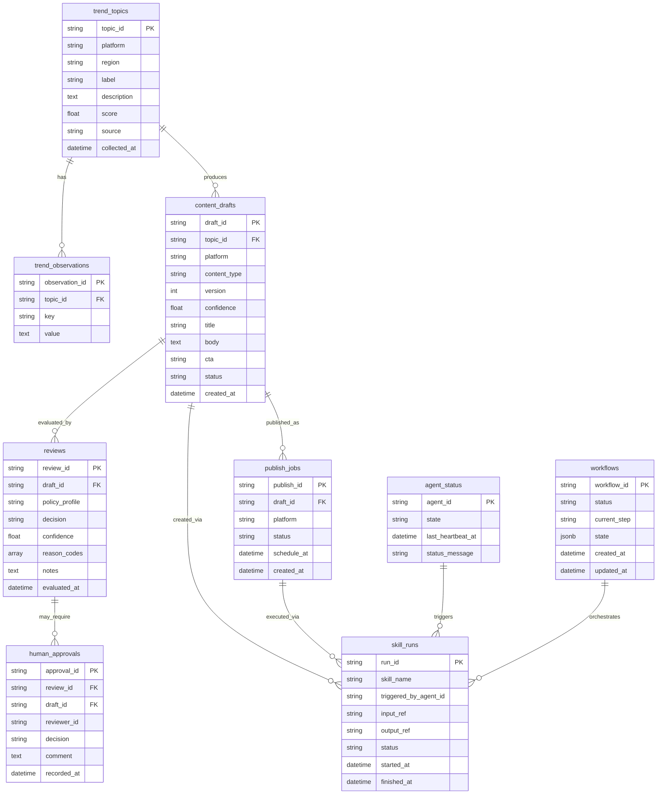

# Project Chimera — Technical Specification

## 1. Scope
This document defines the technical contracts for Project Chimera:
- Agent-facing API contracts (JSON schemas by example)
- Data model and persistence schema for content workflows
- Runtime skill interfaces (inputs/outputs only)

**No implementation code is defined here.** All contracts are framework-agnostic and testable.

**Mapping to Functional Spec**: Each API contract maps to one or more functional capabilities defined in `specs/functional.md` (F1-F10).

---

## 2. Glossary
- **Agent**: A decision-making component that plans and triggers skill calls.
- **Skill**: A deterministic capability package invoked by agents at runtime.
- **Workflow**: A sequence of agent actions governed by approvals and policies.
- **HITL**: Human-in-the-loop approval gate for sensitive actions.
- **Contract**: Strict input/output structure for APIs and skills.
- **Request ID**: Unique identifier for tracing requests through the system.

---

## 3. API Contracts (JSON)

All API contracts use JSON for request and response bodies. All timestamps use ISO 8601 format in UTC (e.g., `2026-02-05T10:00:00Z`).

### 3.1 `POST /v1/trends/fetch` — Research Agent Capability (F1)

**Functional Mapping**: Maps to F1 (Research Agent — Discover Trending Topics)

**Purpose**: Fetches and normalizes trending topics for a platform and region.

**Request**
```json
{
  "platform": "youtube",
  "region": "ET",
  "time_window": "24h",
  "limit": 25
}
```

**Response (Success)**
```json
{
  "request_id": "req_01HTabc123",
  "platform": "youtube",
  "region": "ET",
  "time_window": "24h",
  "collected_at": "2026-02-05T10:00:00Z",
  "topics": [
    {
      "topic_id": "tpc_001",
      "label": "AI tools for developers",
      "description": "Growing interest in AI-powered development tools and coding assistants",
      "score": 0.92,
      "source": "platform_native",
      "collected_at": "2026-02-05T10:00:00Z"
    }
  ]
}
```

**Response (Error)**
```json
{
  "error": {
    "code": "INVALID_PLATFORM",
    "message": "Platform 'invalid_platform' is not supported",
    "details": {
      "field": "platform",
      "expected": "One of: youtube, tiktok, instagram",
      "actual": "invalid_platform"
    },
    "timestamp": "2026-02-05T10:00:00Z",
    "request_id": "req_01HTabc123"
  }
}
```

**Validation Rules**
- `platform` MUST be a non-empty string and exactly one of: `"youtube"`, `"tiktok"`, `"instagram"` (case-sensitive). Invalid values return error code `INVALID_PLATFORM`.
- `region` MUST be an ISO 3166-1 alpha-2 country code (exactly 2 uppercase letters). Invalid codes return error code `INVALID_REGION`.
- `time_window` MUST match pattern `^\d+[hHdD]$` (e.g., `"24h"`, `"7d"`). Invalid format returns error code `INVALID_TIME_WINDOW`.
- `limit` MUST be an integer between 1 and 100 inclusive. Values outside range return error code `INVALID_LIMIT`. If omitted, defaults to 25.
- `topics[].topic_id` MUST match pattern `^tpc_[a-zA-Z0-9]+$`.
- `topics[].score` MUST be a float in range [0.0, 1.0] inclusive. Values outside range are rejected.
- `topics[].label` MUST be a non-empty string, max 200 characters.
- `topics[].description` MUST be a non-empty string, max 500 characters.
- `topics[].collected_at` MUST be ISO 8601 datetime in UTC format.
- Response MUST include `request_id` matching pattern `^req_[a-zA-Z0-9]+$` for traceability.
- Given identical input parameters (including `time_window`), the response MUST return identical `topic_id` values and `score` values (deterministic behavior).
- Response MUST NOT contain any content generation fields (`title`, `body`, `content`, `draft_id`).

---

### 3.2 `POST /v1/content/drafts` — Content Agent Capability (F2)

**Functional Mapping**: Maps to F2 (Content Agent — Generate Content Drafts)

**Purpose**: Creates a content draft from an approved trend topic.

**Request**
```json
{
  "topic_id": "tpc_001",
  "platform": "youtube",
  "content_type": "short_script",
  "tone": "informative",
  "constraints": {
    "max_chars": 1200,
    "avoid_claims_without_sources": true
  }
}
```

**Response (Success)**
```json
{
  "draft_id": "drf_001",
  "topic_id": "tpc_001",
  "platform": "youtube",
  "content_type": "short_script",
  "version": 1,
  "created_at": "2026-02-05T10:05:00Z",
  "confidence": 0.78,
  "title": "AI Tools Developers Actually Use",
  "body": "Here are the AI tools that developers are actually using in 2026...",
  "cta": "Follow for more developer tips.",
  "status": "DRAFT_CREATED"
}
```

**Response (Error)**
```json
{
  "error": {
    "code": "TOPIC_NOT_FOUND",
    "message": "Topic 'tpc_999' does not exist",
    "details": {
      "field": "topic_id",
      "expected": "Valid topic_id from trend discovery",
      "actual": "tpc_999"
    },
    "timestamp": "2026-02-05T10:05:00Z",
    "request_id": "req_01HTabc124"
  }
}
```

**Validation Rules**
- `topic_id` MUST reference an existing `trend_topics.topic_id`. Non-existent topic returns error code `TOPIC_NOT_FOUND`.
- `platform` MUST match one of allowed platform values (same validation as trends/fetch). Must match the platform of the source trend.
- `content_type` MUST be exactly one of: `"short_script"`, `"caption"`, `"post"` (case-sensitive). Invalid type returns error code `INVALID_CONTENT_TYPE`.
- `constraints.max_chars` MUST be a positive integer. If not provided, defaults to 5000. Values > 50000 return error code `INVALID_CONSTRAINT`.
- `draft_id` MUST match pattern `^drf_[a-zA-Z0-9]+$`.
- `confidence` MUST be float in range [0.0, 1.0] inclusive.
- `title` MUST be non-empty string, max 200 characters.
- `body` MUST be non-empty string, max 50000 characters.
- `cta` MUST be string, max 100 characters (optional field).
- Draft creation MUST NOT create any `publish_jobs` records (no publishing occurs).
- If a draft exists for the same `topic_id` + `platform` + `content_type`, new draft MUST have `version = existing_max_version + 1`.
- `status` MUST be `"DRAFT_CREATED"` upon creation.

---

### 3.3 `POST /v1/reviews/evaluate` — Review Agent Capability (F3)

**Functional Mapping**: Maps to F3 (Review Agent — Evaluate Content for Safety and Policy)

**Purpose**: Evaluates a content draft against safety/policy rules.

**Request**
```json
{
  "draft_id": "drf_001",
  "policy_profile": "default",
  "min_confidence_to_autopass": 0.85
}
```

**Response (Success)**
```json
{
  "review_id": "rev_001",
  "draft_id": "drf_001",
  "evaluated_at": "2026-02-05T10:10:00Z",
  "decision": "REQUIRES_HUMAN_REVIEW",
  "reason_codes": ["LOW_CONFIDENCE"],
  "confidence": 0.78,
  "notes": "Confidence below threshold; human approval required."
}
```

**Response (Error)**
```json
{
  "error": {
    "code": "DRAFT_NOT_FOUND",
    "message": "Draft 'drf_999' does not exist",
    "details": {
      "field": "draft_id",
      "expected": "Valid draft_id",
      "actual": "drf_999"
    },
    "timestamp": "2026-02-05T10:10:00Z",
    "request_id": "req_01HTabc125"
  }
}
```

**Validation Rules**
- `draft_id` MUST reference an existing `content_drafts.draft_id`. Non-existent draft returns error code `DRAFT_NOT_FOUND`.
- `policy_profile` MUST be a non-empty string. Unknown profiles return error code `INVALID_POLICY_PROFILE`.
- `min_confidence_to_autopass` MUST be float in range [0.0, 1.0] inclusive. Invalid range returns error code `INVALID_CONFIDENCE_THRESHOLD`.
- `decision` MUST be exactly one of: `"APPROVED"`, `"REJECTED"`, `"REQUIRES_HUMAN_REVIEW"` (case-sensitive, exact match).
- `reason_codes` MUST be a non-empty array of strings. Each code MUST be from allowed set: `["LOW_CONFIDENCE", "POLICY_VIOLATION", "BRAND_SAFETY_VIOLATION", "UNKNOWN"]`.
- `review_id` MUST match pattern `^rev_[a-zA-Z0-9]+$`.
- `confidence` MUST be float in range [0.0, 1.0] inclusive.
- `notes` MUST be string, max 1000 characters (optional field).
- If `decision == "APPROVED"` AND `confidence >= min_confidence_to_autopass`, draft MAY proceed without human approval.
- If `decision == "REJECTED"`, draft MUST NOT proceed to publishing workflow.
- If `decision == "REQUIRES_HUMAN_REVIEW"`, draft MUST NOT proceed until human approval is obtained.

---

### 3.4 `POST /v1/approvals/human` — Human Reviewer Capability (F4)

**Functional Mapping**: Maps to F4 (Human Reviewer — Approve or Reject Sensitive Content)

**Purpose**: Records human approval decision for a draft.

**Request**
```json
{
  "draft_id": "drf_001",
  "review_id": "rev_001",
  "reviewer_id": "usr_123",
  "decision": "APPROVED",
  "comment": "OK to publish."
}
```

**Response (Success)**
```json
{
  "approval_id": "hap_001",
  "draft_id": "drf_001",
  "review_id": "rev_001",
  "reviewer_id": "usr_123",
  "decision": "APPROVED",
  "recorded_at": "2026-02-05T10:15:00Z"
}
```

**Response (Error)**
```json
{
  "error": {
    "code": "INVALID_REVIEW_STATE",
    "message": "Review 'rev_001' does not require human approval (decision is APPROVED)",
    "details": {
      "field": "review_id",
      "expected": "Review with decision REQUIRES_HUMAN_REVIEW",
      "actual": "Review decision is APPROVED"
    },
    "timestamp": "2026-02-05T10:15:00Z",
    "request_id": "req_01HTabc126"
  }
}
```

**Validation Rules**
- `draft_id` MUST reference an existing draft. Non-existent draft returns error code `DRAFT_NOT_FOUND`.
- `review_id` MUST reference an existing review with `decision == "REQUIRES_HUMAN_REVIEW"`. Invalid review state returns error code `INVALID_REVIEW_STATE`.
- `reviewer_id` MUST match pattern `^usr_[a-zA-Z0-9]+$`. Invalid format returns error code `INVALID_REVIEWER_ID`.
- `decision` MUST be exactly `"APPROVED"` or `"REJECTED"` (case-sensitive). Invalid value returns error code `INVALID_DECISION`.
- `comment` MUST be string, max 1000 characters (optional field).
- `approval_id` MUST match pattern `^hap_[a-zA-Z0-9]+$`.
- Human approval MUST be required before publishing when review decision is `"REQUIRES_HUMAN_REVIEW"` or draft confidence is below threshold.
- If `decision == "REJECTED"`, workflow MUST halt and draft MUST NOT proceed to publishing.
- If `decision == "APPROVED"`, draft MAY proceed to publishing workflow (if all other requirements met).

---

### 3.5 `POST /v1/publish/execute` — Planner Agent Capability (F5)

**Functional Mapping**: Maps to F5 (Planner Agent — Orchestrate Content Workflow)

**Purpose**: Publishes approved content (abstracted behind a skill).

**Request**
```json
{
  "draft_id": "drf_001",
  "platform": "youtube",
  "approval_id": "hap_001",
  "schedule_at": "2026-02-05T12:00:00Z"
}
```

**Response (Success)**
```json
{
  "publish_id": "pub_001",
  "draft_id": "drf_001",
  "platform": "youtube",
  "scheduled_at": "2026-02-05T12:00:00Z",
  "status": "SCHEDULED",
  "created_at": "2026-02-05T10:20:00Z"
}
```

**Response (Error)**
```json
{
  "error": {
    "code": "MISSING_APPROVAL",
    "message": "Required human approval is missing for draft 'drf_001'",
    "details": {
      "field": "approval_id",
      "expected": "Valid approval_id when review decision is REQUIRES_HUMAN_REVIEW",
      "actual": "No approval record found"
    },
    "timestamp": "2026-02-05T10:20:00Z",
    "request_id": "req_01HTabc127"
  }
}
```

**Validation Rules**
- `draft_id` MUST reference an existing draft. Non-existent draft returns error code `DRAFT_NOT_FOUND`.
- Draft MUST have a review record with `decision` in `["APPROVED", "REQUIRES_HUMAN_REVIEW"]`. If `decision == "REJECTED"`, returns error code `DRAFT_REJECTED`.
- If review `decision == "REQUIRES_HUMAN_REVIEW"` OR draft `confidence < min_confidence_to_autopass`, `approval_id` MUST reference an existing `human_approvals.approval_id` with `decision == "APPROVED"`. Missing approval returns error code `MISSING_APPROVAL`.
- `schedule_at` MUST be ISO 8601 datetime in UTC. Past dates return error code `INVALID_SCHEDULE_TIME`.
- `publish_id` MUST match pattern `^pub_[a-zA-Z0-9]+$`.
- `status` MUST be one of: `"SCHEDULED"`, `"PUBLISHED"`, `"FAILED"` (case-sensitive).
- Publishing MUST fail if required approval evidence is missing.
- Platform integration details are out of scope; publishing is mediated by a skill contract.

---

### 3.6 `GET /v1/capabilities` — Capability Discovery (F8)

**Functional Mapping**: Maps to F8 (Any Agent — Discover Available Capabilities)

**Purpose**: Returns available skills and their contracts without executing them.

**Request**: No request body (query parameters optional for filtering)

**Response (Success)**
```json
{
  "capabilities": [
    {
      "skill_name": "skill_fetch_trends",
      "description": "Fetch and normalize trending topics",
      "inputs": [
        {
          "name": "platform",
          "type": "string",
          "required": true,
          "constraints": "One of: youtube, tiktok, instagram"
        },
        {
          "name": "region",
          "type": "string",
          "required": true,
          "constraints": "ISO 3166-1 alpha-2 country code"
        },
        {
          "name": "time_window",
          "type": "string",
          "required": true,
          "constraints": "Pattern: ^\\d+[hHdD]$"
        },
        {
          "name": "limit",
          "type": "integer",
          "required": false,
          "constraints": "Range: 1-100, default: 25"
        }
      ],
      "outputs": [
        {
          "name": "topics",
          "type": "array",
          "description": "List of trend topics"
        }
      ],
      "requires_approval": false
    },
    {
      "skill_name": "skill_publish_content",
      "description": "Publish approved content to platform",
      "inputs": [
        {
          "name": "draft_id",
          "type": "string",
          "required": true
        },
        {
          "name": "approval_id",
          "type": "string",
          "required": true,
          "constraints": "Required when human approval needed"
        }
      ],
      "outputs": [
        {
          "name": "publish",
          "type": "object",
          "description": "Publishing result"
        }
      ],
      "requires_approval": true
    }
  ]
}
```

**Validation Rules**
- Capability discovery MUST NOT execute any skills or modify system state.
- Response MUST include all available skills with their input/output contracts.
- `skill_name` MUST match pattern `^skill_[a-zA-Z0-9_]+$`.
- `inputs` and `outputs` arrays MUST include parameter names, types, and constraints.

---

### 3.7 `GET /v1/agents/{agent_id}/status` — Agent Status Query (F9)

**Functional Mapping**: Maps to F9 (Planner Agent — Query Agent Status and Availability)

**Purpose**: Returns current status and availability of an agent.

**Request**: No request body (agent_id in URL path)

**Response (Success)**
```json
{
  "agent_id": "research_agent",
  "state": "idle",
  "last_heartbeat_at": "2026-02-05T10:00:00Z",
  "status_message": "Available for trend discovery requests",
  "capabilities": [
    "skill_fetch_trends"
  ]
}
```

**Response (Error)**
```json
{
  "error": {
    "code": "AGENT_NOT_FOUND",
    "message": "Agent 'invalid_agent' does not exist",
    "timestamp": "2026-02-05T10:00:00Z",
    "request_id": "req_01HTabc128"
  }
}
```

**Validation Rules**
- `agent_id` MUST reference an existing agent. Non-existent agent returns error code `AGENT_NOT_FOUND`.
- `state` MUST be exactly one of: `"idle"`, `"busy"`, `"degraded"` (case-sensitive).
- `last_heartbeat_at` MUST be ISO 8601 datetime in UTC.
- `status_message` MUST be string, max 500 characters (optional field).
- Response MUST NOT expose internal secrets, credentials, or sensitive data.
- Response MUST NOT expose detailed error messages that could leak system information.

---

### 3.8 `POST /v1/workflows/{workflow_id}/pause` — Workflow Interruption (F7)

**Functional Mapping**: Maps to F7 (Planner Agent — Interrupt Workflow for Human Intervention)

**Purpose**: Pauses a workflow to allow human intervention.

**Request**
```json
{
  "reason": "Human review requested"
}
```

**Response (Success)**
```json
{
  "workflow_id": "wf_001",
  "status": "PAUSED",
  "paused_at": "2026-02-05T10:25:00Z",
  "current_step": "awaiting_review",
  "state": {
    "draft_id": "drf_001",
    "review_id": "rev_001"
  }
}
```

**Validation Rules**
- `workflow_id` MUST reference an existing workflow. Non-existent workflow returns error code `WORKFLOW_NOT_FOUND`.
- Workflow MUST NOT be paused if it has already published content (publishing is final). Returns error code `WORKFLOW_FINALIZED`.
- `status` MUST transition to `"PAUSED"` upon successful pause.
- Workflow MUST NOT proceed past pause point until resumed via `POST /v1/workflows/{workflow_id}/resume`.

---

### 3.9 `POST /v1/workflows/{workflow_id}/resume` — Workflow Resume (F7)

**Functional Mapping**: Maps to F7 (Planner Agent — Interrupt Workflow for Human Intervention)

**Purpose**: Resumes a paused workflow.

**Request**: No request body (optional `modifications` object for workflow changes)

**Response (Success)**
```json
{
  "workflow_id": "wf_001",
  "status": "RUNNING",
  "resumed_at": "2026-02-05T10:30:00Z"
}
```

**Validation Rules**
- `workflow_id` MUST reference a paused workflow. Non-paused workflow returns error code `WORKFLOW_NOT_PAUSED`.
- Workflow MUST NOT resume without human instruction (requires authentication/authorization).
- `status` MUST transition from `"PAUSED"` to `"RUNNING"` upon successful resume.

---

### 3.10 `POST /v1/workflows/{workflow_id}/cancel` — Workflow Cancellation (F7)

**Functional Mapping**: Maps to F7 (Planner Agent — Interrupt Workflow for Human Intervention)

**Purpose**: Cancels a workflow, halting further processing.

**Request**: No request body (optional `reason` string)

**Response (Success)**
```json
{
  "workflow_id": "wf_001",
  "status": "CANCELLED",
  "cancelled_at": "2026-02-05T10:35:00Z"
}
```

**Validation Rules**
- `workflow_id` MUST reference an existing workflow.
- Cancelled workflow MUST NOT proceed further (status becomes `"CANCELLED"`).
- Workflow MUST NOT be cancelled if it has already published content.

---

### 3.11 `GET /v1/audit/skill-runs` — Audit Log Query (F10)

**Functional Mapping**: Maps to F10 (Any Agent — Record Actions for Audit)

**Purpose**: Queries audit log of skill executions.

**Request**: Query parameters: `agent_id` (optional), `skill_name` (optional), `start_time` (optional), `end_time` (optional), `limit` (optional, default 100)

**Response (Success)**
```json
{
  "skill_runs": [
    {
      "run_id": "run_001",
      "skill_name": "skill_fetch_trends",
      "triggered_by_agent_id": "research_agent",
      "input_ref": "input_001",
      "output_ref": "output_001",
      "status": "success",
      "started_at": "2026-02-05T10:00:00Z",
      "finished_at": "2026-02-05T10:00:05Z"
    }
  ],
  "total_count": 1,
  "limit": 100
}
```

**Validation Rules**
- Audit records MUST be immutable (cannot be deleted or modified).
- `run_id` MUST match pattern `^run_[a-zA-Z0-9]+$`.
- `status` MUST be one of: `"success"`, `"failure"`, `"in_progress"` (case-sensitive).
- `input_ref` and `output_ref` MUST be references (paths/IDs), not full payloads (for auditability and storage efficiency).
- Response MUST NOT expose full input/output payloads (only references).

---

## 4. Error Response Structure

All API endpoints MUST return errors in the following structure:

```json
{
  "error": {
    "code": "ERROR_CODE_STRING",
    "message": "Human-readable error message",
    "details": {
      "field": "optional field name if validation error",
      "expected": "optional expected value",
      "actual": "optional actual value"
    },
    "timestamp": "ISO-8601 datetime in UTC",
    "request_id": "optional request identifier for traceability"
  }
}
```

**Error Code Enumeration**:
- `INVALID_INPUT`: Generic input validation failure
- `INVALID_PLATFORM`: Platform value not in allowed set
- `INVALID_REGION`: Region code not valid ISO 3166-1 alpha-2
- `INVALID_TIME_WINDOW`: Time window format invalid
- `INVALID_LIMIT`: Limit value outside allowed range
- `INVALID_CONTENT_TYPE`: Content type not in allowed set
- `INVALID_CONSTRAINT`: Constraint value invalid
- `INVALID_CONFIDENCE_THRESHOLD`: Confidence threshold outside [0.0, 1.0]
- `INVALID_POLICY_PROFILE`: Policy profile not recognized
- `INVALID_SCHEDULE_TIME`: Schedule time invalid
- `INVALID_REVIEWER_ID`: Reviewer ID format invalid
- `INVALID_DECISION`: Decision value not allowed
- `INVALID_SCORE`: Score value outside [0.0, 1.0]
- `TOPIC_NOT_FOUND`: Referenced topic does not exist
- `DRAFT_NOT_FOUND`: Referenced draft does not exist
- `REVIEW_NOT_FOUND`: Referenced review does not exist
- `APPROVAL_NOT_FOUND`: Referenced approval does not exist
- `AGENT_NOT_FOUND`: Referenced agent does not exist
- `WORKFLOW_NOT_FOUND`: Referenced workflow does not exist
- `DRAFT_IMMUTABLE`: Draft cannot be modified (already submitted)
- `DRAFT_NOT_APPROVED`: Draft not in approved state for publishing
- `DRAFT_REJECTED`: Draft was rejected and cannot proceed
- `INVALID_REVIEW_STATE`: Review state does not allow requested operation
- `MISSING_APPROVAL`: Required human approval is missing
- `HUMAN_REJECTION`: Human reviewer rejected the content
- `WORKFLOW_NOT_PAUSED`: Workflow is not in paused state
- `WORKFLOW_FINALIZED`: Workflow has completed and cannot be modified
- `UPSTREAM_ERROR`: External dependency failed
- `GENERATION_ERROR`: Content generation failed
- `POLICY_ENGINE_ERROR`: Policy evaluation engine failed
- `PUBLISH_ERROR`: Publishing operation failed

**Retryability**:
- **Non-retryable**: `INVALID_*`, `*_NOT_FOUND`, `DRAFT_REJECTED`, `HUMAN_REJECTION`, `DRAFT_IMMUTABLE`, `WORKFLOW_FINALIZED`
- **Retryable**: `UPSTREAM_ERROR`, `POLICY_ENGINE_ERROR`, `PUBLISH_ERROR` (with exponential backoff, max 3 retries)
- **Conditionally retryable**: `GENERATION_ERROR` (retry only if input unchanged, max 1 retry)

---

## 5. Data Model

### 5.1 Entity Definitions

#### `trend_topics`
Normalized topics discovered from external sources.

**Fields**:
- `topic_id` (PK, string): Unique identifier matching pattern `^tpc_[a-zA-Z0-9]+$`
- `platform` (string): Platform identifier (youtube, tiktok, instagram)
- `region` (string): ISO 3166-1 alpha-2 country code (2 uppercase letters)
- `label` (string): Human-readable topic label, max 200 characters
- `description` (text): Topic description, max 500 characters
- `score` (float): Popularity/confidence score in range [0.0, 1.0]
- `source` (string): Source identifier (e.g., "platform_native")
- `collected_at` (datetime): ISO 8601 timestamp in UTC

**Constraints**:
- `topic_id` is unique and immutable
- `score` must be in range [0.0, 1.0]

#### `trend_observations`
Supporting signals and metadata for a topic (optional, for extensibility).

**Fields**:
- `observation_id` (PK, string): Unique identifier
- `topic_id` (FK, string): References `trend_topics.topic_id`
- `key` (string): Observation key (e.g., "signal_count", "top_hashtags")
- `value` (text): Observation value (JSON-serializable)

**Constraints**:
- Foreign key to `trend_topics` with CASCADE delete

#### `content_drafts`
Draft content versions generated for a topic/platform.

**Fields**:
- `draft_id` (PK, string): Unique identifier matching pattern `^drf_[a-zA-Z0-9]+$`
- `topic_id` (FK, string): References `trend_topics.topic_id`
- `platform` (string): Platform identifier
- `content_type` (string): One of "short_script", "caption", "post"
- `version` (integer): Version number (increments for same topic/platform/type)
- `confidence` (float): Agent confidence in draft quality, range [0.0, 1.0]
- `title` (string): Content title, max 200 characters
- `body` (text): Content body, max 50000 characters
- `cta` (string): Call-to-action text, max 100 characters (optional)
- `status` (string): One of "DRAFT_CREATED", "SUBMITTED_FOR_REVIEW", "REVIEWED", "APPROVED", "REJECTED"
- `created_at` (datetime): ISO 8601 timestamp in UTC

**Constraints**:
- Unique constraint on `(topic_id, platform, content_type, version)`
- Foreign key to `trend_topics` with RESTRICT delete (cannot delete topic with drafts)
- `status` transitions: `DRAFT_CREATED` → `SUBMITTED_FOR_REVIEW` → `REVIEWED` → `APPROVED`/`REJECTED`
- Once `status == "SUBMITTED_FOR_REVIEW"`, `title`, `body`, and `cta` become immutable

#### `reviews`
Automated policy/safety review records.

**Fields**:
- `review_id` (PK, string): Unique identifier matching pattern `^rev_[a-zA-Z0-9]+$`
- `draft_id` (FK, string): References `content_drafts.draft_id`
- `policy_profile` (string): Policy profile identifier (e.g., "default", "strict")
- `decision` (string): Exactly one of "APPROVED", "REJECTED", "REQUIRES_HUMAN_REVIEW"
- `confidence` (float): Review confidence score, range [0.0, 1.0]
- `reason_codes` (array of strings): Reason codes (e.g., ["LOW_CONFIDENCE", "POLICY_VIOLATION"])
- `notes` (text): Review notes, max 1000 characters (optional)
- `evaluated_at` (datetime): ISO 8601 timestamp in UTC

**Constraints**:
- Foreign key to `content_drafts` with CASCADE delete
- `decision` must be one of allowed values (CHECK constraint or enum)
- `reason_codes` must be non-empty array

#### `human_approvals`
Human decision records.

**Fields**:
- `approval_id` (PK, string): Unique identifier matching pattern `^hap_[a-zA-Z0-9]+$`
- `review_id` (FK, string): References `reviews.review_id`
- `draft_id` (FK, string): References `content_drafts.draft_id`
- `reviewer_id` (string): Reviewer identifier matching pattern `^usr_[a-zA-Z0-9]+$`
- `decision` (string): Exactly "APPROVED" or "REJECTED"
- `comment` (text): Reviewer comment, max 1000 characters (optional)
- `recorded_at` (datetime): ISO 8601 timestamp in UTC (immutable)

**Constraints**:
- Foreign keys to `reviews` and `content_drafts` with RESTRICT delete (approvals are immutable)
- `decision` must be "APPROVED" or "REJECTED" (CHECK constraint)
- Records are immutable (cannot be updated or deleted)

#### `publish_jobs`
Scheduled or executed publish events.

**Fields**:
- `publish_id` (PK, string): Unique identifier matching pattern `^pub_[a-zA-Z0-9]+$`
- `draft_id` (FK, string): References `content_drafts.draft_id`
- `platform` (string): Platform identifier
- `status` (string): One of "SCHEDULED", "PUBLISHED", "FAILED"
- `schedule_at` (datetime): ISO 8601 timestamp in UTC (when to publish)
- `created_at` (datetime): ISO 8601 timestamp in UTC

**Constraints**:
- Foreign key to `content_drafts` with RESTRICT delete
- `status` must be one of allowed values
- Cannot be created unless:
  - There exists a `reviews` record with `draft_id` matching and `decision` in ["APPROVED", "REQUIRES_HUMAN_REVIEW"]
  - If review `decision == "REQUIRES_HUMAN_REVIEW"` OR draft `confidence < threshold`, there exists a `human_approvals` record with `decision == "APPROVED"`

#### `agent_status`
Availability/health signaling for agent social network participation.

**Fields**:
- `agent_id` (PK, string): Agent identifier (e.g., "research_agent", "content_agent")
- `state` (string): One of "idle", "busy", "degraded"
- `last_heartbeat_at` (datetime): ISO 8601 timestamp in UTC
- `status_message` (string): Human-readable status message, max 500 characters (optional)

**Constraints**:
- `state` must be one of allowed values
- `last_heartbeat_at` updated automatically on agent activity

#### `skill_runs`
Audit log of skill executions (inputs/outputs references).

**Fields**:
- `run_id` (PK, string): Unique identifier matching pattern `^run_[a-zA-Z0-9]+$`
- `skill_name` (string): Skill name matching pattern `^skill_[a-zA-Z0-9_]+$`
- `triggered_by_agent_id` (string): Agent identifier that triggered execution
- `input_ref` (string): Reference to input data (path/ID), max 500 characters
- `output_ref` (string): Reference to output data (path/ID), max 500 characters
- `status` (string): One of "success", "failure", "in_progress"
- `started_at` (datetime): ISO 8601 timestamp in UTC
- `finished_at` (datetime): ISO 8601 timestamp in UTC (nullable)

**Constraints**:
- Records are immutable (cannot be updated or deleted)
- `input_ref` and `output_ref` store references, not full payloads (for auditability)

#### `workflows`
Workflow state and progression tracking (for F7 workflow interruption).

**Fields**:
- `workflow_id` (PK, string): Unique identifier matching pattern `^wf_[a-zA-Z0-9]+$`
- `status` (string): One of "RUNNING", "PAUSED", "CANCELLED", "COMPLETED", "FAILED"
- `current_step` (string): Current workflow step identifier
- `state` (jsonb): Workflow state snapshot (JSON object)
- `created_at` (datetime): ISO 8601 timestamp in UTC
- `updated_at` (datetime): ISO 8601 timestamp in UTC

**Constraints**:
- `status` must be one of allowed values
- Cannot transition from "COMPLETED" or "FAILED" to other states
- Cannot pause if already published content

### 5.2 Entity Relationship Diagram (ERD)



### 5.3 Schema Constraints Summary

**Immutability Rules**:
- `human_approvals` records cannot be updated or deleted after creation
- `skill_runs` records cannot be updated or deleted after creation
- `content_drafts.title`, `body`, `cta` become immutable when `status == "SUBMITTED_FOR_REVIEW"`

**Referential Integrity**:
- `trend_topics` cannot be deleted if referenced by `content_drafts` (RESTRICT)
- `content_drafts` cannot be deleted if referenced by `reviews` or `publish_jobs` (RESTRICT)
- `reviews` are deleted if `content_drafts` is deleted (CASCADE)
- `human_approvals` cannot be deleted if referenced by `publish_jobs` (RESTRICT)

**State Transitions**:
- `content_drafts.status`: `DRAFT_CREATED` → `SUBMITTED_FOR_REVIEW` → `REVIEWED` → `APPROVED`/`REJECTED`
- `workflows.status`: `RUNNING` → `PAUSED` → `RUNNING`/`CANCELLED` → `COMPLETED`/`FAILED`
- `publish_jobs.status`: `SCHEDULED` → `PUBLISHED`/`FAILED`

**Validation Rules**:
- All ID fields must match their respective patterns (enforced at application level)
- All datetime fields must be ISO 8601 format in UTC
- All score/confidence fields must be in range [0.0, 1.0]
- String length limits enforced at database level (VARCHAR/TEXT constraints)

---

## 6. Runtime Skill Interfaces (Contracts)

Skills are deterministic capabilities invoked by agents at runtime. Skills have strict input/output contracts and MUST be testable.

### 6.1 `skill_fetch_trends` — Research Agent (F1)

**Functional Mapping**: Maps to F1 (Research Agent — Discover Trending Topics)

**Input Contract**
```json
{
  "platform": "youtube",
  "region": "ET",
  "time_window": "24h",
  "limit": 25
}
```

**Output Contract (Success)**
```json
{
  "topics": [
    {
      "topic_id": "tpc_001",
      "label": "AI tools for developers",
      "description": "Growing interest in AI-powered development tools",
      "score": 0.92,
      "source": "platform_native",
      "collected_at": "2026-02-05T10:00:00Z"
    }
  ]
}
```

**Output Contract (Error)**
```json
{
  "error": {
    "code": "UPSTREAM_ERROR",
    "message": "Trend source unavailable",
    "timestamp": "2026-02-05T10:00:00Z"
  }
}
```

**Rules**:
- Input validation matches API contract rules (Section 3.1)
- Output MUST be deterministic given identical inputs
- MUST NOT return content generation fields
- Error codes: `INVALID_INPUT`, `INVALID_PLATFORM`, `INVALID_REGION`, `INVALID_TIME_WINDOW`, `INVALID_LIMIT`, `UPSTREAM_ERROR`

---

### 6.2 `skill_generate_draft` — Content Agent (F2)

**Functional Mapping**: Maps to F2 (Content Agent — Generate Content Drafts)

**Input Contract**
```json
{
  "topic_id": "tpc_001",
  "platform": "youtube",
  "content_type": "short_script",
  "tone": "informative",
  "constraints": {
    "max_chars": 1200,
    "avoid_claims_without_sources": true
  }
}
```

**Output Contract (Success)**
```json
{
  "draft": {
    "draft_id": "drf_001",
    "topic_id": "tpc_001",
    "platform": "youtube",
    "content_type": "short_script",
    "title": "AI Tools Developers Actually Use",
    "body": "Here are the AI tools that developers are actually using in 2026...",
    "cta": "Follow for more developer tips.",
    "confidence": 0.78,
    "version": 1
  }
}
```

**Output Contract (Error)**
```json
{
  "error": {
    "code": "TOPIC_NOT_FOUND",
    "message": "Topic 'tpc_999' does not exist",
    "timestamp": "2026-02-05T10:05:00Z"
  }
}
```

**Rules**:
- Input validation matches API contract rules (Section 3.2)
- MUST NOT trigger publishing actions
- Error codes: `TOPIC_NOT_FOUND`, `INVALID_INPUT`, `INVALID_CONTENT_TYPE`, `INVALID_CONSTRAINT`, `GENERATION_ERROR`

---

### 6.3 `skill_evaluate_policy` — Review Agent (F3)

**Functional Mapping**: Maps to F3 (Review Agent — Evaluate Content for Safety and Policy)

**Input Contract**
```json
{
  "draft_id": "drf_001",
  "policy_profile": "default",
  "min_confidence_to_autopass": 0.85
}
```

**Output Contract (Success)**
```json
{
  "review": {
    "review_id": "rev_001",
    "draft_id": "drf_001",
    "decision": "REQUIRES_HUMAN_REVIEW",
    "reason_codes": ["LOW_CONFIDENCE"],
    "confidence": 0.78,
    "notes": "Confidence below threshold; human approval required.",
    "evaluated_at": "2026-02-05T10:10:00Z"
  }
}
```

**Output Contract (Error)**
```json
{
  "error": {
    "code": "DRAFT_NOT_FOUND",
    "message": "Draft 'drf_999' does not exist",
    "timestamp": "2026-02-05T10:10:00Z"
  }
}
```

**Rules**:
- Input validation matches API contract rules (Section 3.3)
- `decision` MUST be one of: `"APPROVED"`, `"REJECTED"`, `"REQUIRES_HUMAN_REVIEW"`
- `reason_codes` MUST be non-empty array
- Error codes: `DRAFT_NOT_FOUND`, `INVALID_INPUT`, `INVALID_POLICY_PROFILE`, `INVALID_CONFIDENCE_THRESHOLD`, `POLICY_ENGINE_ERROR`

---

### 6.4 `skill_publish_content` — Planner Agent (F5)

**Functional Mapping**: Maps to F5 (Planner Agent — Orchestrate Content Workflow)

**Input Contract**
```json
{
  "draft_id": "drf_001",
  "platform": "youtube",
  "approval_id": "hap_001",
  "schedule_at": "2026-02-05T12:00:00Z"
}
```

**Output Contract (Success)**
```json
{
  "publish": {
    "publish_id": "pub_001",
    "draft_id": "drf_001",
    "platform": "youtube",
    "status": "SCHEDULED",
    "scheduled_at": "2026-02-05T12:00:00Z"
  }
}
```

**Output Contract (Error)**
```json
{
  "error": {
    "code": "MISSING_APPROVAL",
    "message": "Required human approval is missing",
    "timestamp": "2026-02-05T10:20:00Z"
  }
}
```

**Rules**:
- Input validation matches API contract rules (Section 3.5)
- MUST fail if required approval evidence is missing
- MUST NOT expose secrets or tokens in outputs
- Platform integration details are abstracted
- Error codes: `DRAFT_NOT_FOUND`, `DRAFT_NOT_APPROVED`, `DRAFT_REJECTED`, `MISSING_APPROVAL`, `INVALID_SCHEDULE_TIME`, `PUBLISH_ERROR`

---

## 7. Agent Social Network Participation

Chimera MUST be able to publish capabilities and status for agent-to-agent coordination (F8, F9).

### 7.1 Capability Advertisement

**Minimum Required Fields**:
```json
{
  "agent_id": "chimera_core",
  "capabilities": [
    {
      "skill_name": "skill_fetch_trends",
      "description": "Fetch and normalize trending topics",
      "inputs": ["platform", "region", "time_window", "limit"],
      "outputs": ["topics"],
      "requires_approval": false
    },
    {
      "skill_name": "skill_publish_content",
      "description": "Publish approved content to platform",
      "inputs": ["draft_id", "platform", "approval_id", "schedule_at"],
      "outputs": ["publish"],
      "requires_approval": true
    }
  ]
}
```

### 7.2 Status Advertisement

**Minimum Required Fields**:
```json
{
  "agent_id": "chimera_core",
  "state": "idle",
  "last_heartbeat_at": "2026-02-05T10:00:00Z",
  "status_message": "Available for requests"
}
```

**Rules**:
- `state` MUST be one of: `"idle"`, `"busy"`, `"degraded"`
- `last_heartbeat_at` MUST be ISO 8601 datetime in UTC
- MUST NOT expose internal secrets or sensitive data

---

## 8. Out of Scope (Technical)

The following technical details are explicitly out of scope:

- Platform-specific authentication/token integration
- UI/dashboard implementation
- Real-time comment moderation and engagement automation
- Model training / fine-tuning
- Database-specific optimization (indexes, query plans)
- Deployment and infrastructure details
- Monitoring and alerting implementation
- Rate limiting and throttling implementation details

---

## Cross-References

- Functional behaviors and acceptance criteria: `specs/functional.md`
- Runtime skill contracts: `skills/README.md`
- Master constraints and success criteria: `specs/_meta.md`
